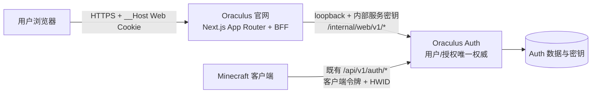

# Oraculus 官网与 Auth 用户系统接入规划

## 1. 目标与结论

建设一个现代、简洁、以账户体验和下载转化为核心的 Oraculus 官网，并让它安全接入现有
Oraculus Auth 服务。

本方案的核心结论：

- 官网框架采用 **Next.js App Router**；
- UI 引擎采用 **shadcn/ui**；
- 样式采用 **Tailwind CSS v4**，图标采用 Lucide；
- 用户身份、密码、等级、Beta 授权、HWID 和审计的唯一权威仍是现有 Auth 服务；
- 官网不接收、保存或刷新 Minecraft 客户端的 AccessToken / RefreshToken；
- 官网通过 Next.js BFF（Backend for Frontend）访问 Auth 新增的内部 Web API，浏览器只持有
  自己域名下的短期不透明 Web 会话 Cookie；
- 现有 `https://auth.hakuri.tech/api/v1/*` 客户端协议保持不变。

本文件是实现设计，不在本阶段创建官网项目、修改线上认证服务器或迁移域名。

## 2. 现有 Auth 能力与接入边界

当前认证服务已经具备可直接复用的用户域模型：

- 用户名、密码哈希、状态、角色、FREE/BETA 等级和 Beta 到期时间；
- HWID 绑定、用户自助 HWID 重置、168 小时冷却；
- 强制修改临时密码，且强制改密不受普通冷却限制；
- 短期客户端 AccessToken 与一次性轮换 RefreshToken；
- 独立的 `webSessions`、HttpOnly Cookie、CSRF Token、用户面板与管理员面板；
- `USER`、`SUPPORT_ADMIN`、`SUPER_ADMIN` 角色，以及简明审计日志。

现有公开客户端 API 是面向游戏客户端的协议。登录、注册和刷新请求都需要设备指纹、
edition、clientVersion 与 buildId；返回的 AccessToken / RefreshToken 只应留在客户端本机安全存储。
官网绝不能把这些客户端令牌用于浏览器登录。

现有 `/user/*`、`/admin/*` 页面属于 Auth 服务内部表单界面，文档也明确它们不是稳定的公共
JSON API。因此新官网不能抓取、模拟或耦合这些 HTML 表单，必须增加版本化的内部 Web API。

## 3. 选择的技术栈

| 层 | 选择 | 原因 |
| --- | --- | --- |
| Web 应用 | Next.js App Router + TypeScript | 同时提供 SEO 友好的营销页、服务端渲染、Route Handler 和受保护账户页；适合作为 Auth 的 BFF。 |
| UI 引擎 | shadcn/ui | 组件代码直接进入仓库，可深度定制且不受黑盒主题限制；适合官网和账户后台共用一套设计语言。 |
| 样式 | Tailwind CSS v4 | 零运行时静态样式，设计 Token、响应式与暗色界面实现成本低。 |
| 无障碍基元 | shadcn/ui 引入的 Radix primitives | 对话框、菜单、Tabs、Sheet、Select 等交互无需自己实现焦点管理。 |
| 图标 | Lucide React | 线性、克制，与产品后台和官网都匹配。 |
| 表单 | React Hook Form + Zod | 登录、注册、改密、HWID 重置可共享客户端校验与服务端错误映射。 |
| 数据边界 | Next.js Server Components + Route Handlers | 默认服务端取数；只有表单、复制、下载、筛选等交互区域使用 Client Components。 |
| 部署 | Ubuntu + systemd + Caddy + Next.js standalone | 不使用 IIS；Caddy 统一接管 TLS 和按域名反向代理，Next/Auth 均仅监听 loopback。 |

### 3.1 为什么选择 shadcn/ui

shadcn/ui 并非把组件锁在 npm 黑盒中，而是把实际组件源码交给项目维护。官网需要统一品牌
风格、账户后台、下载卡片、权限状态和未来的管理面板；可拥有源码比套用 MUI 的 Material
视觉或维护一组散乱组件更合适。

shadcn/ui 官方文档明确其“Open Code / Composition / Beautiful Defaults”原则，提供表单、
Dialog、Dropdown Menu、Table、Tabs、Sheet、Toast、Data Table 等账户系统所需构件。
Next.js 官方文档也将 App Router 定义为支持 Server Components 的新路由体系，并提供
Authentication、Route Handlers、CSP 和部署指南。Tailwind CSS v4 官方文档确认其通过扫描模板
生成静态 CSS，运行时开销为零。

### 3.2 不采用的方案

- 不采用 Auth.js / NextAuth 作为身份权威：会再创建一套账号、Cookie、会话和密码流程，与
  Oraculus Auth 的 HWID、Beta、强制改密和审计产生双写风险。
- 不让浏览器直接调用 `/api/v1/auth/login`：该协议针对游戏客户端，要求设备指纹且会签发
  客户端令牌；它不适合作为网站会话。
- 不在第一期重写管理员后台：现有管理员面板已包含角色层级、搜索、分页和审计。先完成普通
  用户官网和账户中心，管理员仍使用 `auth.hakuri.tech/admin`，避免高权限迁移风险。
- 不把认证数据同步到官网数据库：官网无独立用户表，避免账号状态和授权信息漂移。

## 4. 品牌与视觉方向

### 4.1 设计原则

- 深色优先，但支持系统浅色模式；
- 大留白、低噪声、轻边框，不使用重渐变、玻璃拟态堆叠或强制粒子背景；
- 主要内容宽度 1180–1240px；账户页宽度 960–1120px；
- 单一主强调色为深紫，青色只用于状态与小范围高亮；
- 过渡只用于导航、菜单、按钮与卡片状态，时长 150–220ms；遵循 `prefers-reduced-motion`；
- 所有交互都具备键盘焦点、可见 focus ring、语义标签和错误文本。

### 4.2 初始 Token

```text
背景：          #09090B
表面：          #111318
抬升表面：      #171A21
边框：          #272B35
主文字：        #F4F4F5
次要文字：      #A1A1AA
品牌主色：      #8B5CF6
品牌悬停：      #A78BFA
信息/链接：     #22D3EE
成功：          #34D399
警告：          #FBBF24
危险：          #FB7185
圆角：          12px（卡片）、10px（控件）、8px（紧凑控件）
```

应用中以 CSS Variables 定义上述 Token，再由 Tailwind/shadcn/ui 引用；不要在业务组件内硬编码
色值。

### 4.3 组件基线

首期应引入并封装：Button、Badge、Card、Input、Password Input、Form、Alert、Dialog、Sheet、
Dropdown Menu、Tabs、Table、Pagination、Skeleton、Toast、Tooltip、Separator、Empty 与
Command。所有封装放在 `components/ui`，业务组件放在 `features/*`，禁止页面直接复制一份
Button 或 Input 样式。

## 5. 信息架构与页面范围

### 5.1 第一阶段公开页面

| 路由 | 目标 | 主要内容 |
| --- | --- | --- |
| `/` | 产品首页 | Hero、版本状态、主要能力、CTA、下载入口、状态摘要。 |
| `/download` | 下载中心 | Free/Beta 包说明、版本号、SHA-256、系统要求、安装步骤与更新说明。 |
| `/features` | 功能展示 | 以分类卡片说明视觉、效率与账户能力；不承诺具体服务器绕过效果。 |
| `/changelog` | 更新记录 | 版本、发布日期、迁移提醒、已知限制。 |
| `/status` | 服务状态 | Auth readiness、最近公告、维护窗口；仅展示聚合状态。 |
| `/docs` | 用户文档 | 安装、登录、改密、HWID、常见错误码与隐私说明。 |
| `/legal/privacy`、`/legal/terms` | 合规页面 | 隐私、数据保存、使用条款、支持渠道。 |

### 5.2 账户系统

| 路由 | 未登录行为 | 登录后能力 |
| --- | --- | --- |
| `/login` | 登录表单 | 已登录则跳转 `/account`。 |
| `/register` | 注册 Free 账号 | 已登录则跳转 `/account`。 |
| `/account` | 跳转 `/login` | 用户名、账户状态、Free/Beta、Beta 到期、HWID 是否绑定与品质。 |
| `/account/security` | 跳转 `/login` | 修改密码、强制改密提示、重置 HWID、冷却时间说明。 |
| `/account/sessions` | 跳转 `/login` | 第二期：列出并撤销浏览器会话；不展示客户端 RefreshToken。 |
| `/account/downloads` | 跳转 `/login` | 下载清单、版本兼容性、校验值；Beta 不可用时给出授权原因。 |

### 5.3 管理后台策略

第一期保留现有入口：

```text
https://auth.hakuri.tech/admin/login
```

官网导航对普通用户不展示管理员入口。管理员可由账户页中的角色判断后看到“管理后台”链接，
但链接先跳转到旧后台。第二期再以同一内部 Web API 重建管理员 SPA/SSR 页面，并逐项迁移
用户搜索、分页、创建用户、管理员层级、改密、授权、HWID 与审计日志。

## 6. Auth 接入架构



### 6.1 域名建议

```text
auth.hakuri.tech       认证服务、既有客户端 API、旧管理员后台
oraculus.hakuri.tech   官网、下载中心、账户中心（推荐）
status.hakuri.tech     可选，独立状态页（第二期）
```

若未来品牌主域名确定，可仅替换 `oraculus.hakuri.tech`；Auth API 域名不应在第一期改变，
避免已发布客户端失效。

### 6.2 BFF 会话流程

1. 浏览器在 `oraculus.hakuri.tech/login` 提交用户名和密码到同源 Next Route Handler。
2. Next.js 在服务器端调用 Auth 的 `/internal/web/v1/session/login`。
3. Auth 复用现有密码、状态、限流、角色与审计逻辑，创建 `webSessions` 记录，返回仅供 BFF
   使用的不透明会话令牌、会话到期时间与最小 Account View。
4. Next.js 写入 `__Host-oraculus_web_session`：`HttpOnly; Secure; SameSite=Strict; Path=/`。
5. 后续账户请求由 Next.js 从 HttpOnly Cookie 取会话令牌，并通过内部 API 查询/修改 Auth 数据。
6. 密码修改、HWID 重置或会话撤销后，Auth 按现有规则撤销全部相关 Web/Client 会话；Next.js
   清理 Cookie 并要求重新登录。

浏览器不接触 AccessToken、RefreshToken、原始 HWID、Auth 数据库、内部服务密钥或管理员 Cookie。

### 6.3 新增内部 Web API

所有接口只监听 loopback，且必须同时校验来源地址与共享服务密钥：

```text
Remote address: 127.0.0.1 / ::1
Header: X-Oraculus-Website-Secret: <高熵随机值>
Prefix: /internal/web/v1
```

内部接口不经公网路由、不写入公开 OpenAPI、不接受浏览器直连。建议接口：

| 方法 | 路径 | 作用 |
| --- | --- | --- |
| `POST` | `/session/login` | 创建普通用户 WebSession；复用登录限流和审计。 |
| `POST` | `/session/register` | 创建 Free 用户并创建 WebSession；不需要设备指纹。 |
| `POST` | `/session/logout` | 撤销当前 WebSession。 |
| `GET` | `/account` | 返回经过脱敏的当前 Account View。 |
| `POST` | `/account/password` | 校验当前密码并修改密码；返回必须重新登录的结果。 |
| `POST` | `/account/hwid/reset` | 校验当前密码并重置 HWID；返回必须重新登录的结果。 |
| `GET` | `/account/downloads` | 返回对当前 tier 可见的下载元数据，不返回临时客户端令牌。 |
| `GET` | `/status` | 返回可公开展示的账户/授权状态摘要。 |

每个内部请求携带由 Next.js 生成的 `requestId`。Auth 审计日志记录 actor、目标、动作、成功状态、
原因摘要和 requestId，但不记录密码、Cookie、会话原文、原始 HWID、令牌或完整 IP。

### 6.4 Web API 数据约束

`Account View` 只包含：

```json
{
  "id": "uuid",
  "username": "example_user",
  "role": "USER",
  "tier": "FREE",
  "status": "ACTIVE",
  "betaExpiresAt": null,
  "hwidBound": true,
  "hwidQuality": "STRONG",
  "forcePasswordChange": false,
  "passwordChangeAvailableAt": 0,
  "hwidResetAvailableAt": 0
}
```

禁止返回 `passwordHash`、`hwidHash`、RefreshToken、AccessToken、webSession token、CSRF secret、
密钥路径、内部错误堆栈或完整审计记录。

### 6.5 CSRF 与状态变更

官网的所有写请求都经过 Next.js 同源 Route Handler。每个写接口必须：

- 校验 `Origin` 与 `Host` 为官网域名；
- 使用双提交 CSRF Token，或服务器端会话中的一次性/轮换 CSRF Token；
- 要求 `Content-Type: application/json`；
- 不接受跨站表单；
- 为密码修改与 HWID 重置增加最近认证（re-auth）校验：必须再次提交当前密码；
- 在成功后展示 requestId 的短形式，便于支持排查。

## 7. 网络与部署拓扑

当前 Auth 服务直接占用 TCP 80/443 并自行管理证书。官网要部署到同一台 Ubuntu 主机时，
不能再让两个进程直接绑定 443。推荐分两步迁移为统一边缘代理。

### 7.1 推荐目标拓扑

```text
Internet
  └─ Caddy :80/:443
       ├─ auth.hakuri.tech      → Auth Node 127.0.0.1:3101
       └─ oraculus.hakuri.tech → Next.js    127.0.0.1:3000
```

Caddy 负责自动 TLS、HSTS、静态压缩、基础限流和安全响应头。Auth Node 与 Next.js 不对公网监听。

### 7.2 Auth 迁移的必要改动

因为 Auth 当前以 `request.socket.encrypted` 判断 HTTPS，迁到 Caddy 后必须先实现受信任代理模型：

1. Auth 仅绑定 `127.0.0.1:3101`；
2. 仅当远端地址为 loopback 且 `X-Forwarded-Proto: https` 时认定请求安全；
3. 非 loopback 来源携带的 `X-Forwarded-*` 一律忽略；
4. `AllowedHosts` 继续严格校验 `auth.hakuri.tech`；
5. 用 Caddy 的真实客户端 IP 头作为受信任来源时，必须同样限定为 loopback；
6. 先在 staging/备用端口完整验证客户端 `/api/v1/auth/*`、Cookie、HTTPS 强制、健康检查与
   证书续期，再切换生产 DNS/端口；
7. 保留旧部署包和数据备份，出现问题可立即恢复 Auth 直连 TLS。

不要在未完成上述改动前直接安装 Nginx/Caddy 或停止当前 Auth 服务。

### 7.3 systemd 与机密

建议新增：

```text
/opt/oraculus-web/                       Next.js standalone 输出
/etc/oraculus-web/web.env                0600，root:oraculus-web
/etc/systemd/system/oraculus-web.service
```

`web.env` 至少包含：

```text
NODE_ENV=production
PORT=3000
AUTH_INTERNAL_BASE_URL=http://127.0.0.1:3101/internal/web/v1
ORACULUS_INTERNAL_AUTH_SECRET=<64+ 字符随机值>
```

同一密钥在 Auth 的 root-only 配置文件中保存。密钥轮换支持双值短暂重叠，先更新 Auth 接受集，
再滚动重启官网，最后移除旧值。绝不提交 `.env`、证书、Cookie、管理员密码或生产数据。

## 8. 前端项目结构

建议创建独立仓库 `oraculus-web`，而非将 Node/Next 依赖塞入 Minecraft Mod 的 Gradle 仓库。

```text
oraculus-web/
├─ app/
│  ├─ (marketing)/
│  ├─ (account)/
│  ├─ api/
│  ├─ layout.tsx
│  └─ globals.css
├─ components/
│  ├─ ui/                 shadcn/ui 受控源码
│  ├─ marketing/
│  ├─ account/
│  └─ shared/
├─ features/
│  ├─ auth/
│  ├─ account/
│  ├─ downloads/
│  └─ status/
├─ lib/
│  ├─ auth-server.ts      仅服务端可导入的内部 API 客户端
│  ├─ session.ts
│  ├─ csrf.ts
│  ├─ validation.ts
│  └─ request-id.ts
├─ content/               changelog、文档、下载元数据
├─ public/
└─ tests/
```

`lib/auth-server.ts` 必须带 `server-only` 保护；任何 Client Component、静态资源、浏览器网络面板
都不应看到 `ORACULUS_INTERNAL_AUTH_SECRET` 或内网地址。

## 9. 下载与版本发布

下载文件不能由网页构建目录手工复制。发布流程应由 CI 生成版本清单：

```json
{
  "version": "b6",
  "releasedAt": "2026-07-29T00:00:00Z",
  "artifacts": [
    {
      "edition": "FREE",
      "platform": "fabric-1.21.10",
      "url": "https://downloads.example/Oraculus-Free-b6.jar",
      "sha256": "...",
      "size": 0
    }
  ]
}
```

第一期可把 Free 下载公开展示；Beta 下载页根据账户 tier 与到期时间显示可用、即将到期、未授权或
已过期状态。下载鉴权本身是否需要签名 URL 留到发布策略确认后实现，不能依赖前端隐藏按钮。

## 10. 质量、安全与测试

### 10.1 必须通过的安全测试

- 浏览器 LocalStorage、SessionStorage、HTML、JS bundle 与网络响应中不存在客户端 AccessToken、
  RefreshToken、原始 HWID、内部服务密钥；
- 未登录访问 `/account/*` 统一跳转登录；
- `BANNED`、`DELETED`、`forcePasswordChange`、授权过期均无法进入受保护账户动作；
- 跨站 POST、缺少/错误 CSRF、Origin 不匹配均返回拒绝；
- 密码修改或 HWID 重置后，当前 Web Cookie 与游戏客户端会话均失效；
- 内部 Web API 从非 loopback、无密钥、错误密钥、错误 Host 调用均被拒绝；
- 公开 API、内部 API、用户账户操作均产生无敏感数据的审计记录；
- 错误页只显示用户可读消息和 requestId，不泄露 Node 堆栈或路径。

### 10.2 体验与无障碍验收

- 移动端 360px、平板、桌面三档可用；
- 登录、注册、改密表单支持键盘、屏幕阅读器和密码管理器；
- 颜色对比满足 WCAG AA；
- 首屏不依赖大型视频或第三方追踪脚本；
- Lighthouse 指标以生产实测为准：公开页 LCP < 2.5s、CLS < 0.1；
- 账号页加载失败有可恢复错误状态，不把 Auth 临时故障误报成账号被封。

## 11. 分阶段实施计划

### Phase 0：基础与协议设计

- 冻结官网域名、产品文案、隐私/条款责任人；
- 为 Auth 编写 `internal/web/v1` DTO、权限矩阵和 Node 自测；
- 定义 Caddy 迁移与回滚 runbook；
- 新建独立 `oraculus-web` 仓库和 CI 骨架。

### Phase 1：营销页与无登录下载中心

- 建立 Next.js + shadcn/ui + Tailwind 基座和设计 Token；
- 完成首页、下载、功能、更新、状态、文档、法律页；
- 发布版本清单和 SHA-256 展示；
- 不接 Auth，不影响现有认证服务。

### Phase 2：普通用户账户中心

- 实现内部 Web API 与 Next.js BFF Cookie 会话；
- 接入登录、注册、账户概览、强制改密、改密、HWID 重置和退出；
- 完成安全/CSRF/限流/会话撤销测试；
- 以小范围账号灰度验证后上线。

### Phase 3：统一边缘代理与生产部署

- 在 staging 验证 Caddy + loopback Auth + Next.js；
- 完成 443 切换、HTTPS、Health、客户端 API 回归和回滚演练；
- 上线 `oraculus.hakuri.tech`，保持 `auth.hakuri.tech` 客户端兼容。

### Phase 4：增强能力

- 账户会话列表与撤销；
- 签名下载链接与发布渠道；
- 管理后台渐进迁移；
- 状态页、公告、支持工单或购买流程（须另行设计支付、退款和隐私边界）。

## 12. 上线验收清单

- 官网与 Auth 只有一套用户、角色、授权和审计数据；
- 原 Minecraft 客户端的登录、刷新、心跳、退出和 Beta 校验无行为回归；
- 官网无法获取或签发客户端 AccessToken / RefreshToken；
- 普通用户只能看到和操作自己的账户；
- 管理员权限与 `SUPER_ADMIN` / `SUPPORT_ADMIN` 层级一致；
- Caddy/Next/Auth 均不直接暴露敏感端口或环境变量；
- 每次部署具备健康检查、数据库/密钥备份验证和可操作的回滚步骤；
- 用户文档解释密码冷却、HWID 冷却、Beta 到期、强制改密与常见认证错误码。

## 13. 参考资料

- [shadcn/ui 官方文档](https://ui.shadcn.com/docs)
- [Next.js 官方文档](https://nextjs.org/docs)
- [Tailwind CSS 官方文档](https://tailwindcss.com/docs)
- 项目现有 [Auth API 接入文档](auth-server/API_INTEGRATION_ZH.md)
- 项目现有 [Ubuntu Auth 部署说明](auth-server/ubuntu/README_ZH.md)
